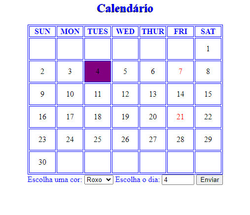
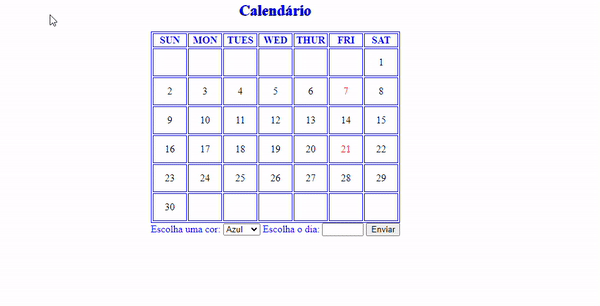
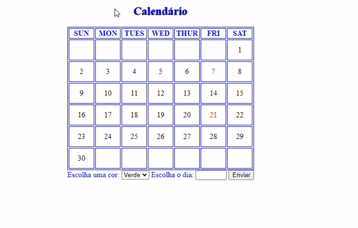
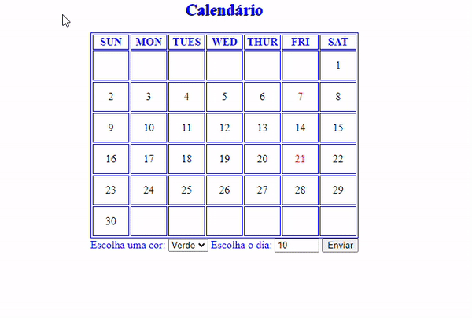

# INDÍCE
[Projeto de Calendário interativo- Introdução](#projeto-de-calend%C3%A1rio-interativo---introdu%C3%A7%C3%A3o)   
[Funcionalidades](#funcionalidades)  
[Tecnologias utilizadas](#tecnologias-utilizadas)  
[Fontes consultadas](#fontes-consultadas)  
[Autores](#autores)  

# Projeto de Calendário interativo - Introdução

Durante as aulas de progamação, para o ensino de Javascript, ,mais especificamente o "function", criamos um calendário interativo na qual o usuário pode escolher um dia e colorir a data da cor que ele prefeir!

## Funcionalidades

### ESCOLHER A COR

Ao clicar no botão, o nome da cor selecionada é adiciona ao CSS. Para realizar essa ação damos um nome para a cor e usamos o function para colorir a data.

### SELECIONAR A DATA PARA COLORIR

Agora para selecionar o dia que o usuário deseja colorir o function procura nos blocos o espaço dado com aquele nome. Exmplo, se o usuário selecionar o dia 5, o código vai procurar pelo bloco dado como número 5 para colorir. 

### BOTÃO DE ENVIAR

Ao final, quando o usuário clica no botão de enviar, a data escolhida ganha cor!

## Tecnologias utilizadas
Neste projetos tivemos o uso de:
* HTML 5 
* CSS 3
* JAVASCRIPT
* GIT 
* GITHUB

## Fontes consultadas
[lohhans](https://gist.github.com/lohhans/f8da0b147550df3f96914d3797e9fb89) - Um modelo para fazer um bom README  
[Alura](https://www.alura.com.br/artigos/escrever-bom-readme) - Como escrever um README incrível no seu Github  

## Autores
Sarah Ozeto, com a orientação do professor Leonardo Rocha.
